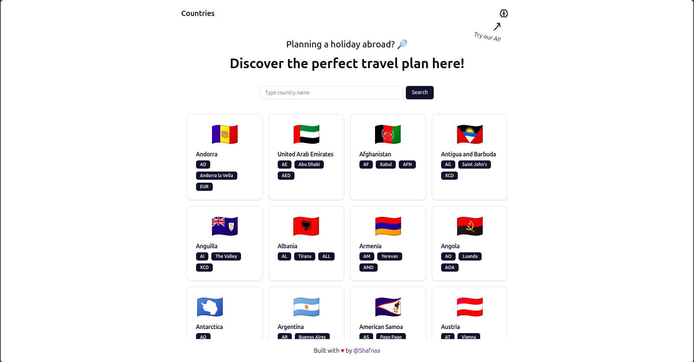

<h1 align="center">
  <br>
  Countries
  <br>
</h1>

<h4 align="center">A minimal country information web app using <a href="https://countries.trevorblades.com" target="_blank">Trevor Blades Country API</a>.</h4>

<p align="center">
  <a href="#key-features">Key Features</a> •
  <a href="#setup-instructions">How To Use</a> •
  <a href="#download">Download</a> •
  <a href="#credits">Credits</a> •
  <a href="#related">Related</a> •
  <a href="#license">License</a>
</p>



## Available Features

- Display list of countries with somoe basic information.
- AI powered travel recommendation.
- AI powered country information.

## Setup Instructions

To clone and run this application, you'll need [Git](https://git-scm.com), [Node.js](https://nodejs.org/en/download/) (which comes with [npm](http://npmjs.com)), and [Bun](https://bun.sh) installed on your computer. From your command line:

1. Clone the repository

```bash
git clone https://github.com/Shafnaa/kuasar
```

2. Go into the repository

```bash
cd kuasar
```

3. Install dependencies

```bash
bun install
```

4. Setup your .env file

```bash
cat .env.example > .env.local
```

5. Run the development server

```bash
bun run dev
```

6. Open a new terminal & go into the repository

```bash
cd kuasar
```

7. Run the express server

```bash
bun run server.ts
```

## Technical decisions and architecture

Tech Stack:

- Vite + React + SWC + TypeScript
- React Router v6
- Tailwindcss
- Apollo
- Shadcn
- OpenAI
- Express
- marked.js
- axios

I'm not really used to building a React SPA using especially using the v7 React Router. So, rather than using the v7, I choose to use the v6 where the routing style is similar to the last time I use React Router. At first, I was planning on using the Tanstack React Query, turns out the Apollo client itself provides chacing out of the box. So React Query won't be necessary if I don't need to make another request outside GraphQL Apollo client.

For the authentication, I was planning on using Supabase for the authentication services. But unfortunately I wasn't able to achieve this because turns out for the OAuth I'll be needing an express server to handle the authentication itself. Initially, I also planing to use Supabase to store the history of the AI chat so that the user will be able to see their previous chat.

## Future improvements

- Chat History
- Authentication
- OAuth Authentication

---

> [saujanashafi.me](https://saujanashafi.me) &nbsp;&middot;&nbsp;
> GitHub [@Shafnaa](https://github.com/Shafnaa) &nbsp;&middot;&nbsp;
> Instagram [@saujanashafi](https://instagram.com/saujanashafi) &nbsp;&middot;&nbsp;
> X [@saujanashafi](https://x.com/saujanashafi)
